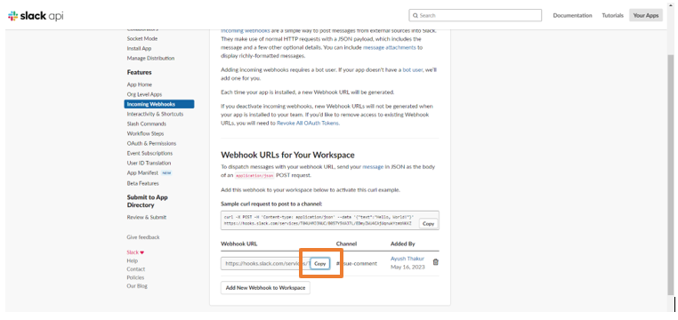

# Grafana resource utilization threshold event triggers a Discord message

GitHub is the largest web-based platform that provides developers with a place to host and manage their software projects.

You can receive notifications when specific events occur in a repository by adding a GitHub Source on Vanus Connect.

This guide will help you get a Discord notification whenever someone open a new pull request in your repository.

<iframe width="800" height="450" src="https://www.youtube.com/embed/45-jXxfN8XQ" title="YouTube video player" frameBorder="0" allowFullScreen={true} allow="accelerometer; autoplay; clipboard-write; encrypted-media; gyroscope; picture-in-picture; web-share"></iframe>

## Get Started

### Step 1: Configure the Source

- Log in to [Vanus Connect](https://cloud.vanus.ai/) and choose the **Grafana resource utilization threshold event triggers a Slack message** template.

### Step 2: Configure Sink - Get the Slack Webhook URL

- Open Slack API in your browser, create a Webhook URL and copy it

Tip: For detailed steps on how to obtain the Slack Webhook URL, refer to the blog [Get Your Slack Webhook URL - A Quick Integration Guide](https://www.vanus.ai/blog/get-your-slack-webhook-url/).

- Paste the copied URL in the "Webhook URL" in Sink Configuration and click Submit

- Your connection has been succesfully setup

### Step 3: Create a Contact Point in Grafana

- Open the newly created connection and copy the webhook URL

- Open [Grafana](https://grafana.com/) and login your account

- Open the left sidebar and go to Alerts & IRM

- Click on Alerting, go to Contact Points and Click on Add Contact

- Give a name of the contact point, select "Webhook" in the Integration section and paste the copied URL in the URL section

- Finally, click on Save Contact Point. Your Connecton is working pefectly now
