# S3 Upload Object Event triggers a Discord message

S3 is one of the most popular service provided by Amazon Web Services

S3 service allows the user to store objects through a web service interface

This guide will help you get a Discord notification whenever a new object gets uploaded on your S3 service

<iframe width="800" height="450" src="https://www.youtube.com/embed/d-5wDjr4-Z0" title="YouTube video player" frameBorder="0" allowFullScreen={true} allow="accelerometer; autoplay; clipboard-write; encrypted-media; gyroscope; picture-in-picture; web-share"></iframe>

## Get Started

### Step 1: Configure the Source

- Log in to [Vanus Connect](https://cloud.vanus.ai/) and choose the **S3 Upload Object Event triggers a Discord message** template.

### Step 2: Get Access key

- Go to [Aws Management Console](https://aws.amazon.com/) and login using your root account

- Search for IAM services and click on it

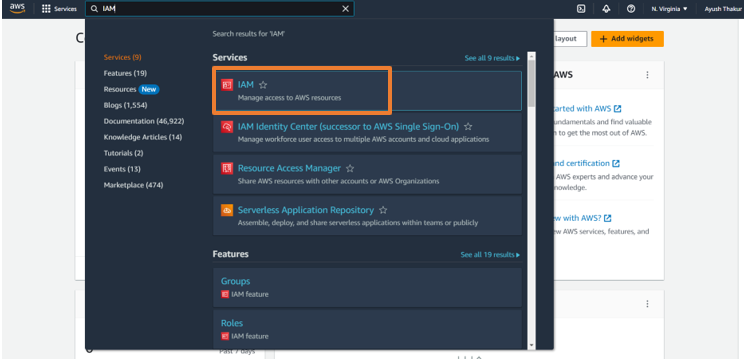

- Go to Users on left sidebar and click on Add User

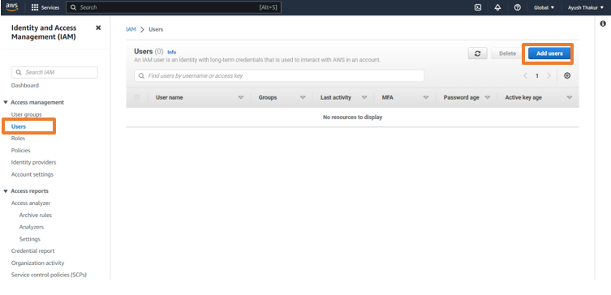

- Give a name to the user and click on Next

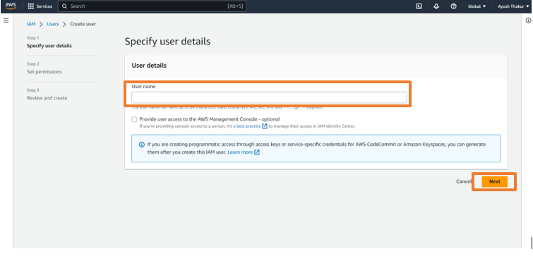

- Select Attach policies directly and click on Create Policy

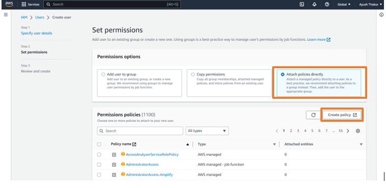

- Click on S3 and search for PutBucketNotification and select it

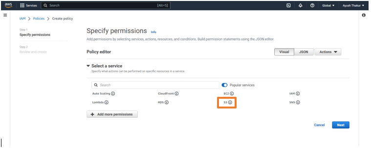

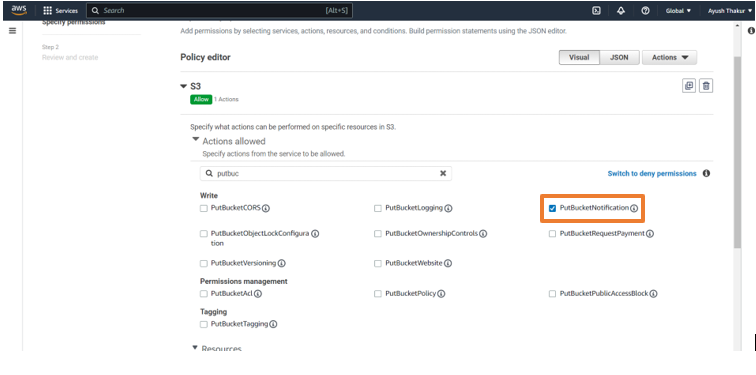

- Click on Add more permissions and search for SQS and click on it

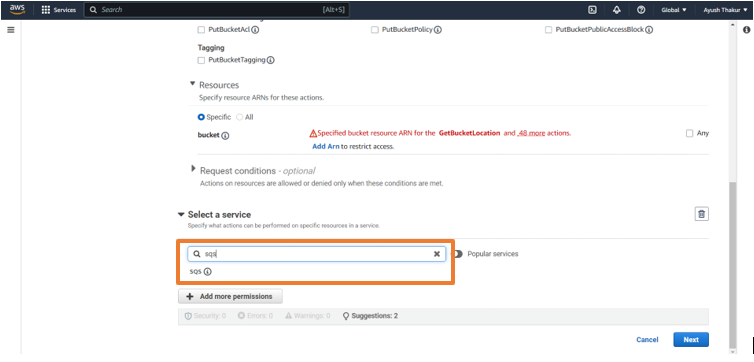

- Now search these policies are add them:

1. ListQueues
2. GetQueueUrl
3. ReceiveMessage
4. GetQueueAttributes
5. CreateQueue
6. SetQueueAttributes
7. DeleteMessage

and press Next

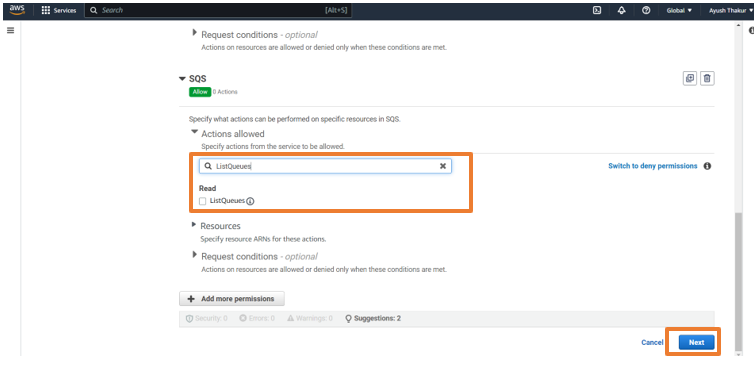

- Add a name to your policy and click on Create Policy

- Go back to the previous tab and refresh it

- Search for the custom policy we have created and select it and click Next

- Review it and click Create User

- Click on the created user and go to Security and Credentials tab

- Scroll down and click Create access key

- Select Command line interface CLI, press Next and click Create access key

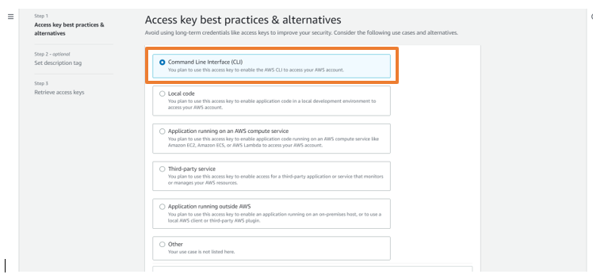

- Copy the access key and secret access key and paste them in Connection setup

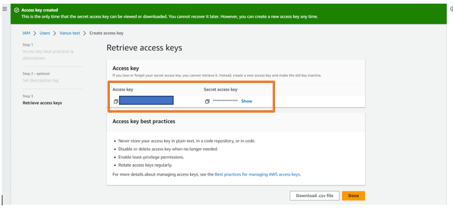

### Step 3: Create ARN number

- Go to AWS console and search for S3 service and click on it

- Click on Create New bucket

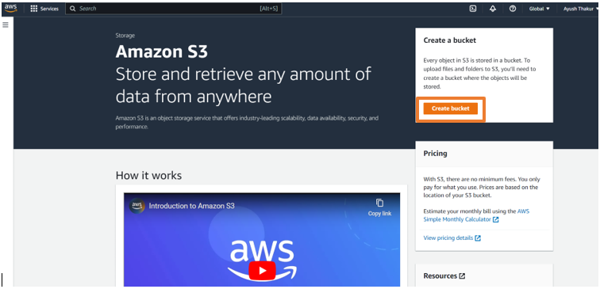

- Give a name to the bucket and click Create Bucket

- Open the created bucket and go to properties tab

- Copy the ARN Number and paste it in connection setup and click Next

### Step 4: Configure Sink - Get the Discord Webhook URL

- Open Discord in your browser and go to your desired Discord Server

- Go to the Server settings and click on Integrations

- Click on New Webhook. Open the newly created Webhook and Copy the Webhook URL

- Paste the copied URL in the "Webhook URL" in Sink Configuration and click Submit

- Your connection has been succesfully setup
