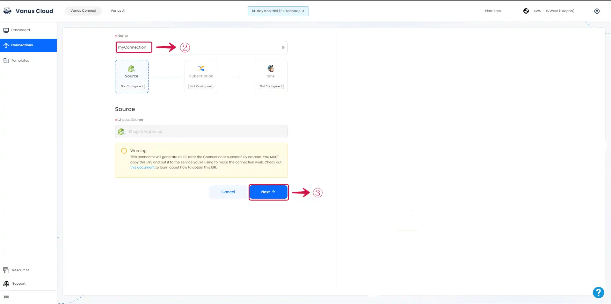
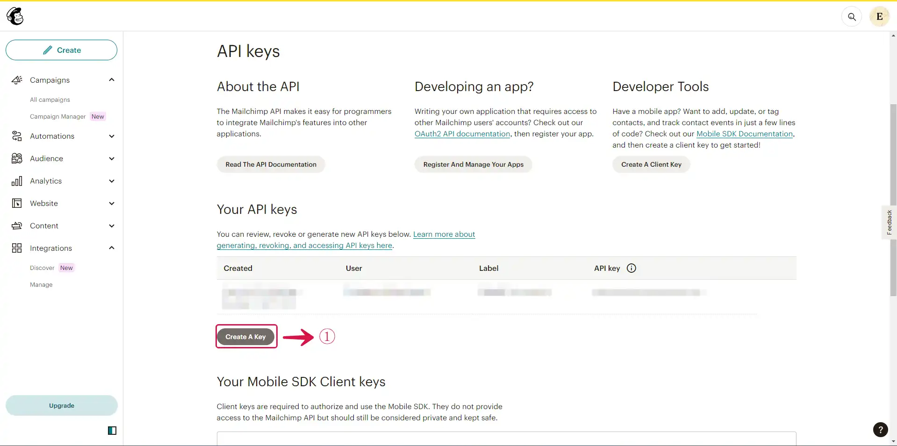
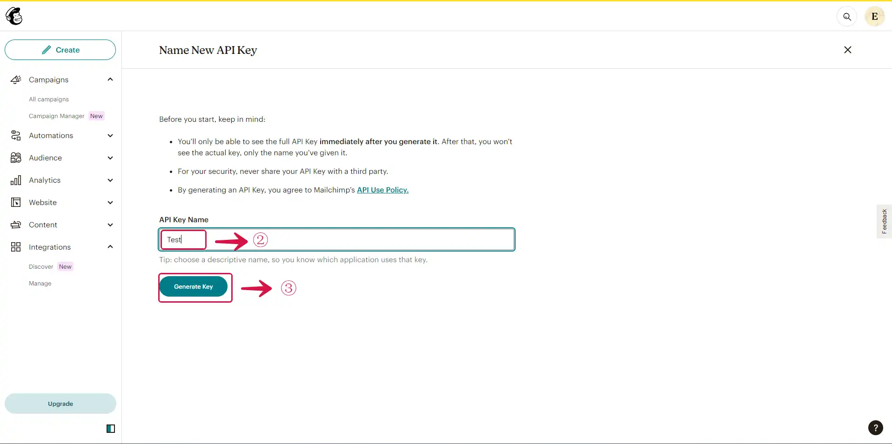
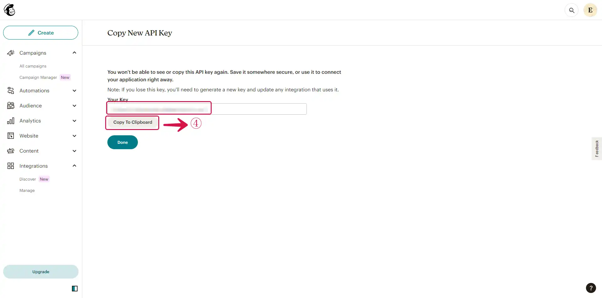
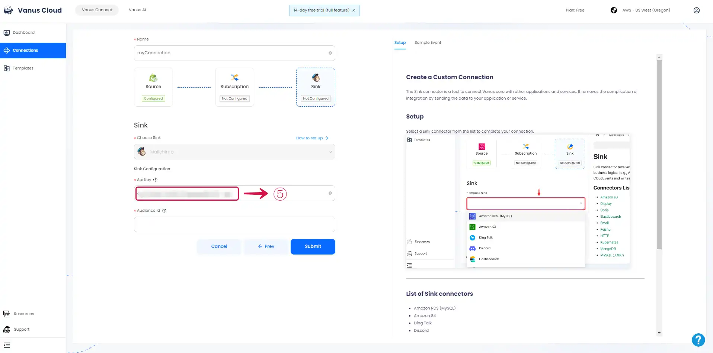
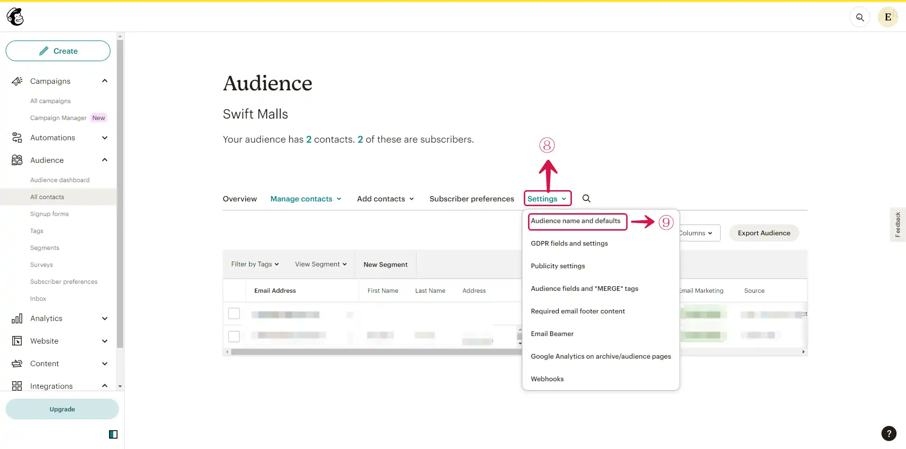
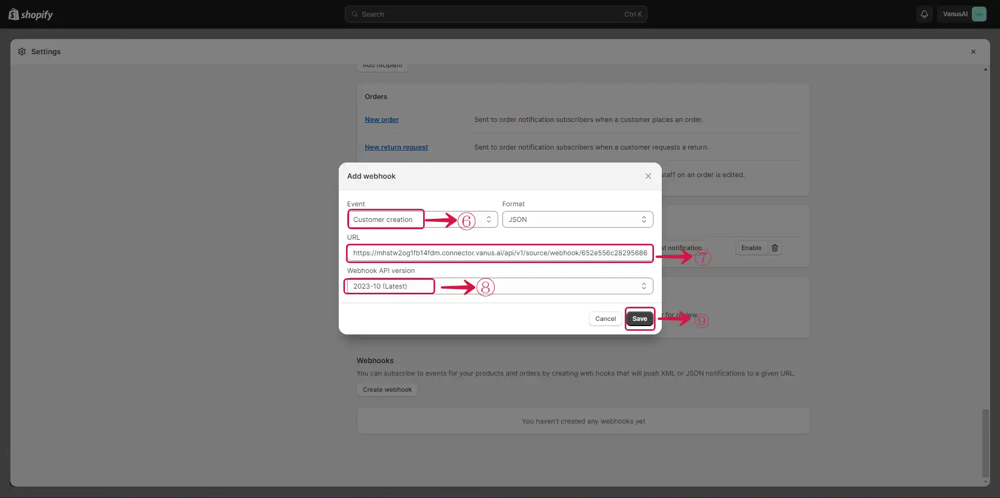
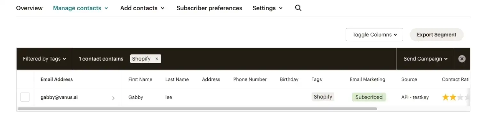

# Shopify customer create event add user to Mailchimp List

Shopify is a popular e-commerce platform that enables individuals and businesses to create and manage online stores.

By employing Vanus Connect, you can automatically add your new Shopify users to your Mailchimp list when they create an account. 

This guide is designed to assist you in setting up a system where you can add your new Shopify users to your Mailchimp list when they create an account. 

## Getting Started

### Step 1: Configure the Source

1. Log in to [Vanus Connect](https://cloud.vanus.ai/) 

2. Choose the **Add new Shopify customers to Mailchimp** template. Click on **Try it now**①.

3. Give the Conncection a **Name**②, and click **Next**③.

## Step 2: Configure the Sink

1. Sign in to your [Mailchimp](https://mailchimp.com/) account in a new tab.

2. To obtain the API Key, visit [Mailchimp API Key](https://us1.admin.mailchimp.com/account/api/).

3. Click on the **Create A Key**① button.

4. Fill the field **API Key Name**② and click the **Generate Key**③ button.

5. **Copy**④ the API Key and click on Done.

 

6. Paste the API Key in the **Api Key**⑤ field.

 

7. At the left sidebar of your Mailchimp Dashboard, Click on the **Audience**⑥ dropdown menu, then click on **All contacts**⑦.

8. Click on **Settings**⑧ dropdown menu and select **Audience name and defaults**⑨.

9. Copy the **Audience ID**⑩.

10. Paste the Aduience ID in the **Audience Id**⑪ field click the **Submit**⑫ button..

 

## Step 3: Configure Vanus Connect to receive Shopify events

After creating the connection in Vanus Connect, we have to configure our connection to receives events from our Shopify Store.

1. Click on the **connection name**①.

 

2. **Copy**② the Webhook URL.

3. Navigate to your Shopify Admin Dashboard and click on the **Settings**③ button.

4. Click the **Notification**④ menu on the sidebar.

5. Click on the **Create webhook**⑤ button.

6. Select the **Event**⑥, Paste the Webhook URL in the **URL**⑦ field, select the **Webhook API version**⑧, and click the **Save**⑨ button.

### Result Display

Now lets's test our connection. Whenever a user signs up on our Shopify store, the user is automatically added to our Mailchimp subscriber list.

