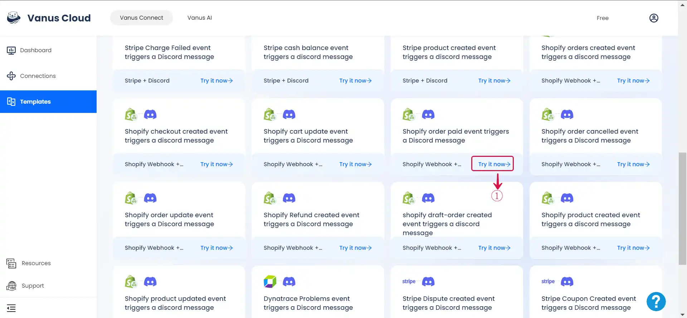
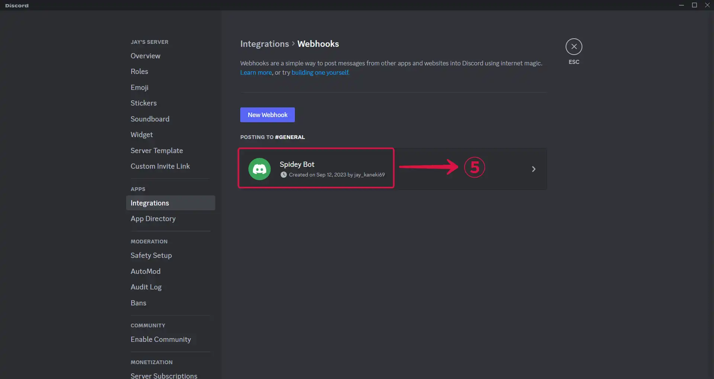
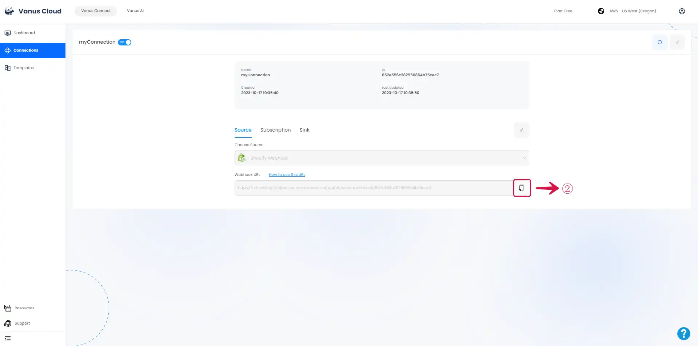
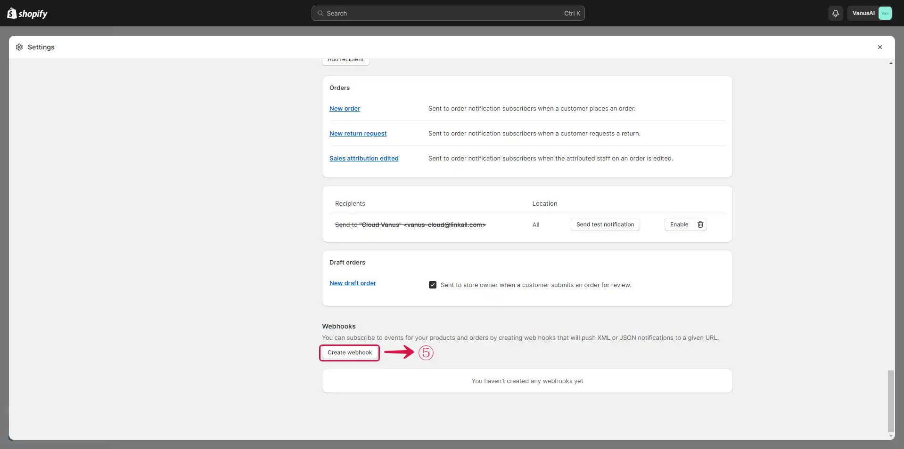
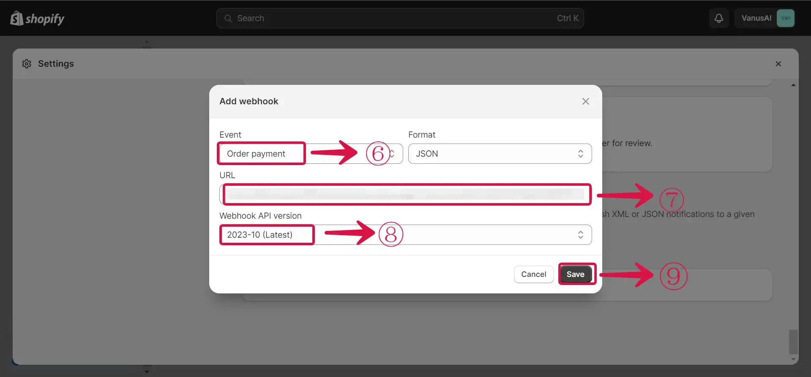
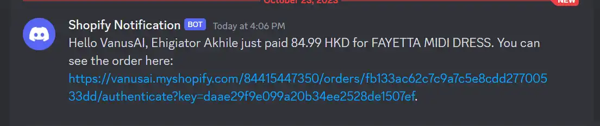

# Shopify orders paid event create triggers Discord message

Shopify is a popular e-commerce platform that enables individuals and businesses to create and manage online stores.

By employing Vanus Connect, you can automatically get notified on Discord when an order is paid for.

This guide is designed to assist you in setting up a system where you get notified on Discord when an order is paid for.

## Getting Started

### Step 1: Configure the Source

1. Log in to [Vanus Connect](https://cloud.vanus.ai/) 

2. Choose the **Shopify order paid event triggers a Discord message** template. Click on **Try it now**①.

3. Give the Conncection a **Name**② and click **Next**③.

### Step 2: Create a Discord Server 

1. Go to the Discord application.

2. Create a new server by clicking the `+`① icon.

3. Choose a template or create your own, by selecting **Create My Own**②.

4. Click on **Skip this question**③ to move to the next step of your configuration.

5. Input a **Server Name**④ and click on **Create**⑤.

### Step 3: Get a webhook URL

1. Bring out the drop down settings menu by clicking `⌄`①.

2. Select **Server Settings**②.

3. Click on **Integrations**③ in the sidebar menu under APPS.

4. Click **Create Webhook**④.

5. Click on **Spidey Bot**⑤, the webhook you just created.

6. Tap the **Copy Webhook URL**⑥ button.

### Step 4: Discord Connection Settings

1. Go back to Vanus Connect.

2. Paste your webhook URL in the **Webhook URL**① field, and click **Submit**②.

## Step 5: Configure Vanus Connect to receive Shopify events

After creating the connection in Vanus Connect, we have to configure our connection to receives events from our Shopify Store.

1. Click on the **connection name**①.

 

2. **Copy**② the Webhook URL.

 

3. Navigate to your Shopify Admin Dashboard and click on the **Settings**③ button.

 

4. Click the **Notification**④ menu on the sidebar.

 

5. Click on the **Create webhook**⑤ button.

 

6. Select the **Event**⑥, Paste the Webhook URL in the **URL**⑦ field, select the **Webhook API version**⑧, and click the **Save**⑨ button.

 

### Result Display

When a user pays for a product in your Shopify Store, the Order is automatically added to as new row in Google Sheets.

