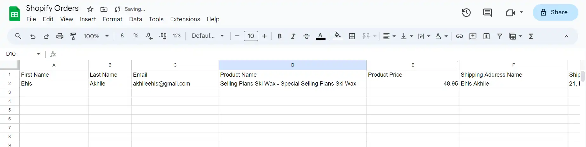

# Shopify orders paid event create new row in Google Sheets

Shopify is a popular e-commerce platform that enables individuals and businesses to create and manage online stores.

By employing Vanus Connect, you can automatically add paid orders to your Google Sheets spreadsheet as a new row.

This guide is designed to assist you in setting up a system where you add paid orders to your Google Sheets spreadsheet as a new row.

## Getting Started

### Step 1: Configure the Source

1. Log in to [Vanus Connect](https://cloud.vanus.ai/) 

2. Choose the **Add new paid Shopify orders to Google Sheets rows** template. Click on **Try it now**①.

3. Give the Conncection a **Name**②

4. Click **Next**③.

### Step 2: Obtain Google Sheets Spreadsheet ID and Configure the Sink

1. Sign In to [Google Sheets](https://docs.google.com/spreadsheets/create) and create a new Sheet.

2. **Copy**① the Spreadsheet ID.

3. For the Sink Configuration, **Authenticate**② with Google, Paste the Google **Spreadsheet ID**③, provide the **Sheet Name**④, and Click on the **Submit**⑤ button.

## Step 3: Configure Vanus Connect to receive Shopify events

After creating the connection in Vanus Connect, we have to configure our connection to receives events from our Shopify Store.

1. Click on the **connection name**①.

 

2. **Copy**② the Webhook URL.

 

3. Navigate to your Shopify Admin Dashboard and click on the **Settings**③ button.

 

4. Click the **Notification**④ menu on the sidebar.

 

5. Click on the **Create webhook**⑤ button.

 

6. Select the **Event**⑥, Paste the Webhook URL in the **URL**⑦ field, select the **Webhook API version**⑧, and click the **Save**⑨ button.

 

### Result Display

When a user pays for a product in your Shopify Store, the Order is automatically added to as new row in Google Sheets.

