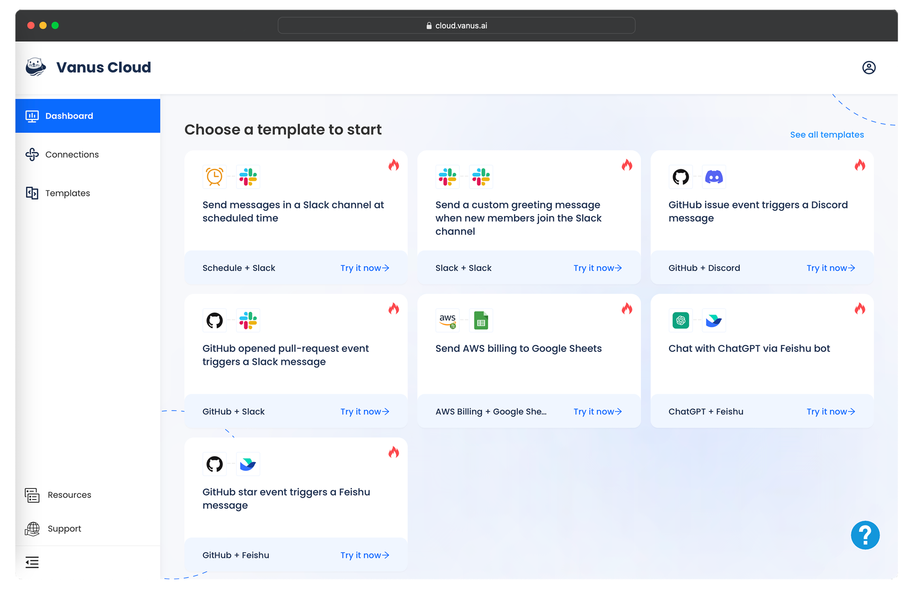

# What is Vanus Cloud?

Vanus Cloud is a cloud-based service that makes it easy for users to create event-driven applications without the hassle of setting up and managing their own Vanus server. With Vanus Cloud, you can quickly and easily build connections between SaaS, cloud services, and databases, allowing you to easily automate, notify, and streamline your processes.

Our user-friendly interface simplifies the process of setting up connections, making event streaming and processing accessible to everyone, regardless of technical expertise. Whether you're a seasoned developer or a non-technical user, Vanus Cloud enables you to leverage the power of event-driven architectures without worrying about complex code or infrastructure management.

We're passionate about helping our users save time and resources while enjoying the benefits of instant data delivery. Join the growing number of businesses and developers by signing up for Vanus Cloud today using your email address, Google account, or GitHub account.
## Common questions

### **What specific SaaS, cloud services, and databases can be connected through Vanus Cloud?**

Vanus Cloud offers a wide range of connectors that can be used to integrate with popular SaaS applications, cloud services, and databases. Some of the most commonly used connectors include:

- Amazon Web Services (AWS)
- Auth0 
- ChatGPT
- GitHub
- Slack
- Discord
- Shopify
- MySQL
- CloudEvents
- HTTP
- and more.

Our platform is designed to be highly flexible and versatile, so if you don't see a connector for the SaaS, cloud service, or database you need to connect with, please let us know. We're constantly adding new connectors to our platform, and we're always happy to work with our users to ensure that their specific integration needs are met.

### **Can Vanus Cloud be integrated with existing applications, or does it require a different setup?**

While Vanus Cloud is designed to simplify the process of building connections between your SaaS, cloud services, and databases, it's important to note that it may require some integration work to connect with your existing applications. However, our platform is highly versatile and can be integrated with a wide range of systems and applications.

We provide a large selection of connectors, including source and sink connectors, which can be used to integrate with popular databases, cloud services, and SaaS applications. Additionally, our platform offers general and flexible filtering rules, which allow you to easily filter events based on your needs.

If you require assistance with integration, our support team is always available to help. We're dedicated to ensuring a seamless experience for our users, and we'll work with you to ensure that your existing applications can be easily integrated with Vanus Cloud.

### **What level of technical knowledge is required to use Vanus Cloud effectively?**

Vanus Cloud is designed to be user-friendly and accessible to a wide range of users, regardless of their technical expertise. While some technical knowledge may be helpful when using our platform, it is not required to get started.

Our platform is designed to simplify the process of building connections between your SaaS, cloud services, and databases, and we offer a variety of templates that make it easy to get started. These templates remove the need to set up subscriptions and define custom messages, making it easy to create real-time data pipelines without any coding required.

We also provide extensive documentation and support resources to help you every step of the way. Our documentation includes step-by-step guides, video tutorials, and frequently asked questions to help you get started and troubleshoot any issues you may encounter.

If you require additional support, our support team is always available to assist you. We're dedicated to ensuring a seamless experience for our users, and we'll work with you to ensure that you can use Vanus Cloud effectively, regardless of your technical background.

