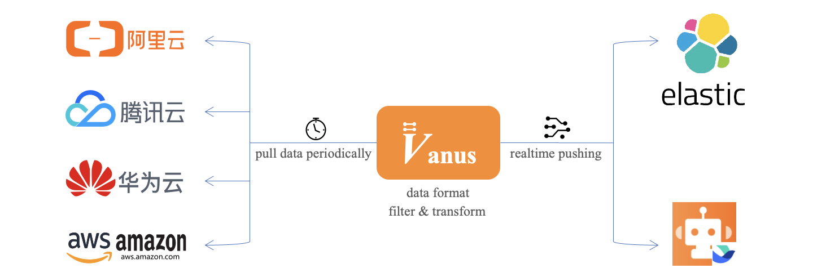
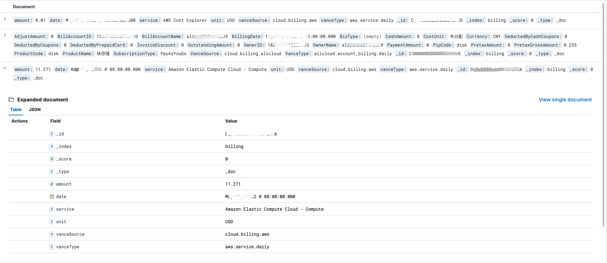
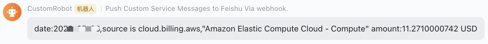

# Use Cloud Billing Source to retrieve bills from cloud vendors

## Overview

Billings from cloud vendors allow users to observe the cost of resource.

Vanus obtains bills by using interfaces from various cloud vendors. It uses Elasticsearch for data storage to achieve unified management of bills. It also notifies the team of abnormal expenses via Feishu-bot.

In this tutorial, you will learn how to use Cloud Billing Source of Vanus to aquire the billing from Cloud Service providers like AWS, AliCloud, and store the data in Elasticsearch, if any resource caused unusual billing, and would send out alret via feishu-bot.

## Prerequisites

- [Install Vanus](https://github.com/linkall-labs/docs/blob/main/vanus/quick-start.md)

- Install Elasticsearch and Kibana

  ```bash
  kubectl apply -f install-elasticsearch.yaml
  ```

- Config Feishu-bot（ [自定义机器人指南](https://open.feishu.cn/document/ukTMukTMukTM/ucTM5YjL3ETO24yNxkjN)）

## Step 1: Create EventBus

```bash
vsctl eventbus create --name tutorials
```

## Step 2: Create Source & Sink

Now navigate to the `tutorials/billing` directory

```bash
cd ./docs/tutorials/billing
```

Do the following steps.

### Create Data Source - bills from cloud vendors

Use command line create [AWS Billing Source](https://github.com/linkall-labs/vance/blob/main/connectors/source-aws-billing/README.md) and [AliCloud Billing Source](https://github.com/linkall-labs/vance/blob/main/connectors/source-alicloud-billing/README.md),

1. Modify the attribute  `env` in file source-aws-billing.yaml
   - Modify `ACCESS_KEY_ID` 
   - Modify `SECRET_ACCESS_KEY` 
2. Modify file source-alicloud-billing.yaml
   - Modify `ACCESS_KEY_ID`
   - Modify `SECRET_ACCESS_KEY` 
3. Then, apply that yaml using `kubectl`:

```bash
kubectl apply -f source-aws-billing.yaml
kubectl apply -f source-alicloud-billing.yaml
```

### Create Target End - Elasticsearch

Use the command line of Vanus create the event target: [Elasticsearch Sink](https://github.com/linkall-labs/vance/blob/main/connectors/sink-elasticsearch/README.md),

1. Modify sink-elasticsearch-billing.yaml, attribute `env`:`ADDRESS`,`USERNAME`,`PASSWORD` are all configuration of Elasticsearch

2. Then, apply that yaml using `kubectl`:

```bash
kubectl apply -f sink-elasticsearch-billing.yaml
```

### Create Target End  - Feishu-bot

Use the command line of Vanus create the event target: [Feishu-bot](https://github.com/linkall-labs/vance/blob/main/connectors/sink-feishu-bot/README.md)

1. Modify sink-feishu-bot.yaml, attribute `env`
   - Modify ` V_TARGET` ，this is webhook provided by feishu-bot
   - Modify `FEISHU_SECRET` ，this is secret token provided by feishu-bot

2. Then, apply that yaml using `kubectl`:

```
kubectl apply -f sink-feishu-bot.yaml
```

## Step 3: Subscription Event

### Create Elasticsearch Subscription

Create Subscription Event, here can do filter before deliver event to sink end, execute the following command:

```bash
vsctl subscription create \
  --eventbus tutorials \
  --sink 'http://elasticsearch-billing-sink.default:8080' \
  --filters '[
    {
      "suffix": {
          "source":".billing"
      }
    }
  ]'
```

- `sink` Points to the target end of the event delivery.
- `filters` The method of filter the events. 
  - use keyword `suffix` to do the postfix match for attribute source

### Create Feishu-bot Subscription

Create Subscription Event, here can do filter before deliver event to sink end, execute the following command:

```bash
vsctl subscription create \
  --eventbus battle \
  --sink 'http://feishu-bot-sink.default' \
  --filters '[
        {
            "suffix": {
                "source":".billing"
            }
        },
        {
            "cel":"$amount.(double) >= 8.013"
        }
    ]' \
  --input-transformer '{
      "define": {
        "date": "$.data.date",
        "amount": "$.data.amount",
        "unit": "$.data.unit",
        "source": "$.source",
        "service": "$.data.service"
      },
      "template": "date:${date},source is ${source},\"${service}\" amount:${amount} ${unit}"
    }'
```

- `sink` Points to the target end of the event delivery.
- `filters` The method of filter the events. 
  - `suffix` to do the postfix match for attribute source
  - `cel`key word for filter the attributes by expression，for example to filter a resource attribute (amount)> threshold(8.013);
- `input-transformer` attribute for event transform，redefine the content of event by template
  - `define`, keyword for define the variable which template would need。use JSONPath get the content of the event，and save it in the defined variable;
  - `template` , keyword，for doing the transform of event by customized format, then route to target.

## Step 4: Result Checking

### Check the Billing Data

Now let's connect to kibana so that we can manage data and perform data analysis.



### Check Warning Message

When certian resource in billing triggered  Feishu-bot, you would see the warning message in your group:



## Summary

In this tutorial, we have learned:

- How to join two sources and two sink.
- How to use to do the event filter and content transform.

