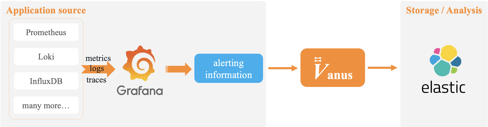
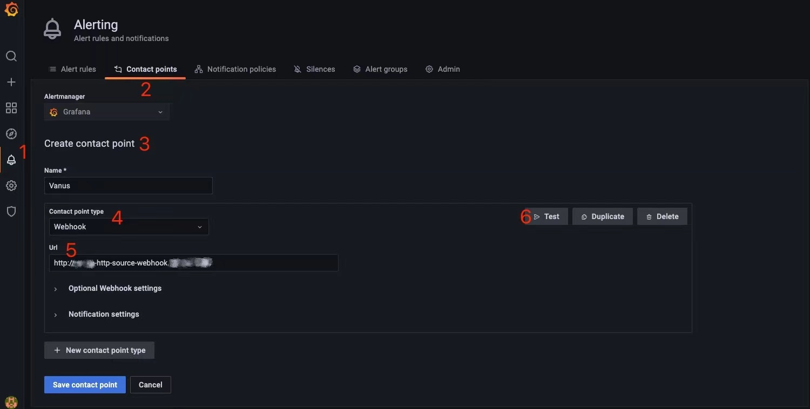
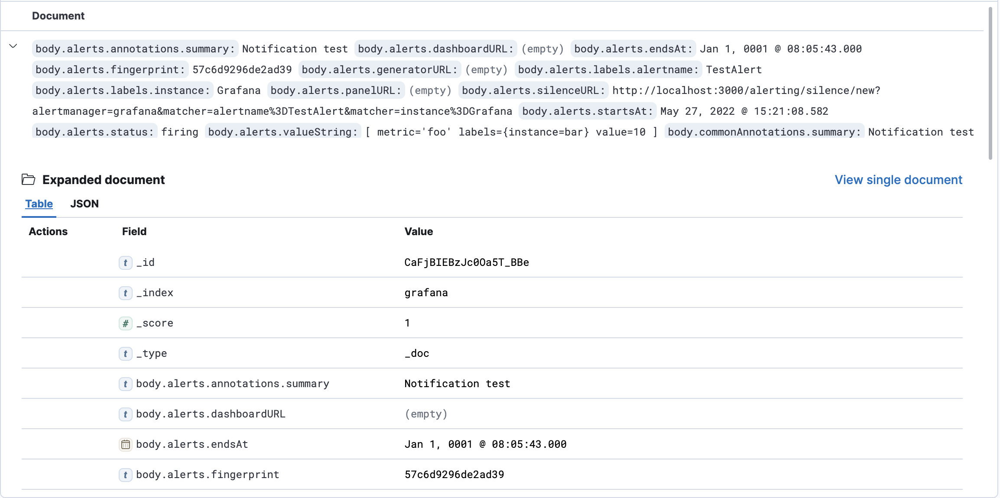

# Use HTTP Source as Grafana webhook URL

## Overview

Vanus can easily do integration with Grafana and manage events such as alerts and so on.
Grafana is an open and composable observability and data visualization platform, which supports lots of event metrics.



In this tutorial, you will learn how to use Vanus's HTTP Source Connector with Grafana data source to acquire the alert data; How to use Vanus's Elasticsearch Sink Connector to save alert data to Elasticsearch.

## Prerequisites

- [Install Vanus](https://github.com/linkall-labs/docs/blob/main/vanus/quick-start.md)

- Install and run Grafana

  ```bash
  kubectl apply -f install-grafana.yaml
  ```

- Install and run Elasticsearch and Kibana

  ```bash
  kubectl apply -f install-elasticsearch.yaml
  ```

## Step 1: Create EventBus

```bash
vsctl eventbus create --name tutorials
```

## Step 2: Create Source & Sink

Now navigate to the `tutorials/http` directory

```bash
cd ./docs/tutorials/http
```

### Create HTTP Source Service

Create via cli [HTTP Source](https://github.com/linkall-labs/vance/blob/main/connectors/source-http/README.md).
```bash
kubectl apply -f source-http.yaml
```

### Create Sink End - Elasticsearch

Leveraging the command line of Vanus to create the event sink: [Elasticsearch Sink](https://github.com/linkall-labs/vance/blob/main/connectors/sink-elasticsearch/README.md),

1. Modify sink-elasticsearch-grafana.yaml, attribute `env`: `ADDRESS`,`USERNAME`,`PASSWORD` are all configurations of Elasticsearch
2. Then, apply that yaml using `kubectl`:

  ```bash
  kubectl apply -f sink-elasticsearch-grafana.yaml
  ```

## Step 3: Subscription

With Vanus command line, you can create Subscription Event. You can do a filter before delivering event to sink end:
```bash
vsctl subscription create \
  --eventbus tutorials \
  --sink 'http://elasticsearch-grafana-sink.default:8080' \
  --filters '[
    {
      "exact": {
          "source":"vance.http"
      }
    }
  ]'
```

- `sink` the target of the event delivery.

- `filters` the ways of filtering the events. 

- use keyword `exact` to do the exact match for the attribute source.


## Step 4: Event Delivery & Result Checking

### Add Alert Event Delivery

1. Login Grafana console

2. In the left menu select Alerting > Contact points， then click【New Contact points】

3. In Contact points tab， fill the following parameters:

   - Name：give it a name
   - Contact point type：select【Webhook】
   - Url： http://http-webhook-source.default:8080

   

4. Click【Test】to simulate alerts, the sample of alert data is as follows:

   ```json
   {
        "orgId": 1,
        "state": "alerting",
        "title": "[FIRING:1]  (TestAlert Grafana)",
        "alerts": [{
                "endsAt": "0001-01-01T00:00:00Z",
                "labels": {
                        "instance": "Grafana",
                        "alertname": "TestAlert"
                },
                ...,
                "valueString": "[ metric='foo' labels={instance=bar} value=10 ]",
                "dashboardURL": "",
                "generatorURL": ""
        }],
        "status": "firing",
        ...,
        "commonLabels": {
                "instance": "Grafana",
                "alertname": "TestAlert"
        },
        "truncatedAlerts": 0,
        "commonAnnotations": {
                "summary": "Notification test"
        }
   }
   ```

### Check Alert Data

Now let's connect to kibana where we can manage data and do data analysis.



## Summary

In this tutorial, you can learn:

- How to use sources and sink.
- For similar tools like Jenkins, GitHub, and Prometheus which support using Webhook to trigger events,  both alert and event can be saved via Vanus.
