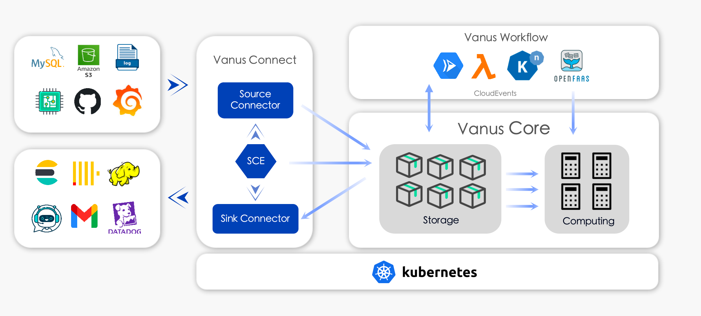

# Architecture

This article introduces Vanus architecture to you from the business perspective, you can be learned how many components
Vanus have, and what role they're played.

The goal of Vanus is automatically and transparently scale up or down in order to meet near-zero administration,
maintenance, or scaling burden. So, the principle of design Vanus follow `Service Oriented Architecture(SOA)`.
SOA helps us to resolve many challenges such that predictable behaviors, high available, scalability, etc.
Following are 3 main parts in Vanus.

## Vanus Core

The implementation of Message Queue functionalities. It separates storage and computing resources. Storage Service
supports [long-term persistence](../concepts/eventbus.md#retention-policy) and tired-storage(SSD->HDD->S3) for event
streaming. Computing Service is consisted by various services like Trigger and Timing, which implements different
features of Vanus like [Subscription](../concepts/subscription.md), [Delay/Schedule Event](../concepts/special-messages.md), etc.

## Vanus Connect

To simple understanding, Vanus Connect is a set producer and consumer that out-of-box to provide interoperability
across services, platforms, and systems.

### Source Connector

Source Connector obtains events from event sources, converts events into CloudEvents format, and sends them to any
HTTP endpoint that supports the CloudEvents format. It supports both pull and push event acquisition methods.
For SaaS software or cloud services such as Github, Amazon S3, etc., that provides a webhook mechanism, events are
pushed to the Source Connector by the event source. For data systems such as message queues and databases, events are
pulled from the event source by the Source Connector.

### Sink Connector

It receives CloudEvents events sent by HTTP endpoints, and routes events to database systems, SaaS software, or cloud
services after performing certain processing on the events.

### SCE

:::info
Each connector is constructed with Docker, so it can work independently without SCE. SEC just provides extra
availability and scalability to connectors.
:::
**SCE(Serverless Connector Engine)** is the coordinator, which is responsible for the autoscaling of Source Connector and
Sink Connector, which supports automatically scaling up from 0 to n and scales down from n to 0 according to event
traffic or other users' conditions.

## Vanus Workflow

:::
Vanus Workflow is working in progress.
:::
Vanus provides full compatible with [ServerlessWorkflow](https://github.com/serverlessworkflow/specification).

Serverless Workflow focuses on defining a **vendor-neutral**, **platform-independent**, and **declarative** workflow language that
targets the serverless computing technology domain. It can be used to significantly bridge the gap between your unique
business domain and the target technology domain.
